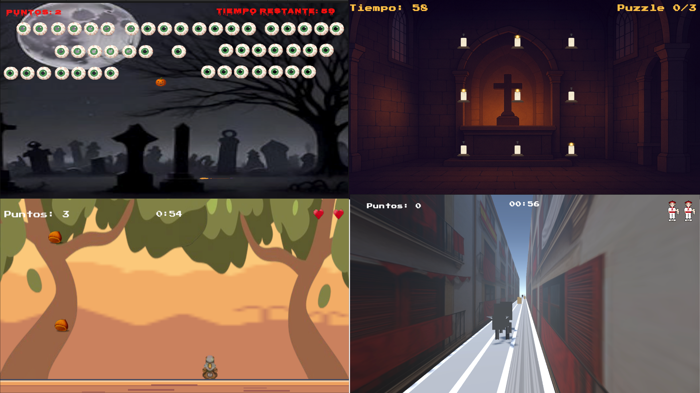

# UOC Gamers — 2D Collection + VR Prototype

  

**UOC Gamers** is a Unity project that includes a collection of **three 2D mini-games** and one **VR prototype**.  
Each game is inspired by popular festivities and themes, combining arcade-style mechanics with short-session gameplay.

This repository is presented as an **academic project** developed for the **DAM program** at the **Universitat Oberta de Catalunya (UOC)** by the **UOC Gamers** team.

---

## Games Included

### Castanyera (2D)
Objects fall from the top of the screen (**chestnuts and stones**).  
Players control a character (the Castanyera woman) and must **catch chestnuts** while avoiding obstacles.

### Halloween Arkanoid (2D)
A Halloween-themed Arkanoid-style game.  
A **pumpkin** bounces around the level while the player controls a **broom** paddle to break **eye-shaped blocks**.

### Luz Divina (2D Puzzle)
A candle puzzle game with a **3x3 grid**.  
When you press a candle, it toggles its state and also toggles the adjacent candles, requiring logic to **switch all candles off**.

### Running of the Bulls (VR Prototype)
A VR prototype inspired by **San Fermín**.  
Players move through **three lanes** and must avoid incoming **bulls and obstacles** by tilting their head (gyroscope-based movement).  
Difficulty increases progressively over time.

---

## Documentation

Extended documentation is available in both languages:

- 🇬🇧 [**English documentation**](README_en.md)
- 🇪🇸 [**Documentación en español**](README_es.md)

---

## Setup & Requirements

Technical requirements, build configuration, and gameplay instructions are documented separately:

- 🇬🇧 [**Setup & Requirements (English)**](SETUP.md)
- 🇪🇸 [**Instalación y requisitos (Español)**](INSTALACION.md)

---

## Download APK

The latest APK can be downloaded from the **Releases** section:
- [Releases](./releases)

---

## Related Repository

This project was originally planned as a unified experience including **2D games**, an **AR mode**, and a **3D/VR prototype**.  
However, due to integration constraints and build stability issues, the final delivery is split into two repositories:

- This repository contains the **2D games + VR prototype**

The companion repository contains the **AR game: Tio AR**:

- [**Companion Repository (Tio AR)**](https://github.com/RaulEstevezA/tioar)

---

## Technologies

- Unity 6
- C#
- TextMeshPro
- Android build (APK)
- 2D Physics
- XR Management (VR prototype)

---

## Download APK

The latest APK can be downloaded from the **Releases** section:

- [Releases](../../releases)

---

## Team

This project was developed by the **UOC Gamers** team:

- **Aleix Ortiz** [GitHub](https://github.com/Aortiz1UOC) | [LinkedIn](https://www.linkedin.com/in/aleix-ortiz-4796291aa/)
- **Carlos Ruz** [GitHub](https://github.com/cruzd92) | [LinkedIn](https://www.linkedin.com/in/carlosruzd92/)
- **Jordi Montserrat** [GitHub](https://github.com/supermusta) | [LinkedIn](https://www.linkedin.com/in/jordi-montserrat-cornejo-4320b886/)
- **Raul Estevez** [GitHub](https://github.com/RaulEstevezA) | [LinkedIn](https://www.linkedin.com/in/raulesteveza/)
- **Roger Mohino** [GitHub](https://github.com/rogermohino) | [LinkedIn](https://www.linkedin.com/in/roger-mohino/)

---

## License

This project is licensed under the **Creative Commons Attribution-NonCommercial-NoDerivatives 4.0 International License**.  
See the [LICENSE](LICENSE) file for details.

---

## Notes

- This README provides a high-level overview of the project.
- Detailed explanations, screenshots, gameplay rules, and setup steps are available in the extended documentation.
- The AR experience is available in the companion repository.